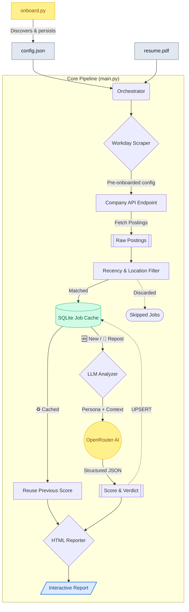

# Job Hunter Agent — Phase 1

An intelligent, automated agent designed to discover, filter, and score job opportunities from targeted company career pages against a candidate's resume using LLMs.

---

## 📋 Requirements & Problem Statement

Job hunting traditionally involves manually monitoring dozens of company career pages, filtering through irrelevant roles (wrong location, old postings), and reading dense descriptions to determine fit. 

**Phase 1 Objective:** Automate the manual discovery, filtering, and evaluation pipeline.
- Discover career pages automatically given only a company name.
- Filter out stale jobs and mismatched locations natively without LLM costs.
- Parse a candidate's resume and intelligently score remaining roles for fit.
- Generate a highly readable, interactive report with actionable application links.
- Avoid re-evaluating the same job across daily runs to optimize LLM usage and time.

---

## 💡 Solution Overview

The system acts as an orchestrated pipeline consisting of **Onboarding**, **Scraping**, **Filtering**, **LLM Scoring**, **Caching**, and **Reporting**.

When initialized with a target company list and a candidate resume, it reads pre-onboarded API endpoints from `config.json`, pulls all active listings, filters out roles older than `recency_days` or outside of `location_preferences`, and passes the remaining high-quality candidates to an LLM.

The LLM (configured as a senior technical recruiter) reads the job description alongside the resume, assigning a score from 0-100, extracting explicit strengths and gaps, and providing a final verdict. The output is a self-contained HTML report where every entry provides a direct external link to apply.

### System Flowchart



---

## 🏗️ Architecture & Key Modules

| Component | Responsibility | Technical Details |
| --- | --- | --- |
| **`onboard.py`** | Company Onboarding CLI | Discovers Workday career site API endpoints via 3-tier search (DuckDuckGo → HTML probe → brute-force). Validates by fetching 1 job, then persists the full config to `config.json`. |
| **`main.py`** | Pipeline Orchestration | Reads pre-onboarded company configs, controls the loop over companies, manages the cache check, triggers LLM scoring, and dispatches the HTML reporter. |
| **`config_loader.py`** | Environment & Settings | Loads `config.json` (model selection, target companies, filters) and parses the `.env` file for the `OPENROUTER_API_KEY`. |
| **`resume_parser.py`** | Context Extraction | Uses `pypdf` to extract raw text content from the user's provided PDF resume. |
| **`scrapers/workday.py`** | API Discovery & Extraction | Interacts with undocumented Workday JSON endpoints (`/wday/cxs/...`). Maps internal API paths to user-facing browsable career site URLs. |
| **`analyzer.py`** | LLM Evaluation Engine | Formats a strict system prompt (recruiter persona) requiring fixed JSON output (`score`, `strengths`, `gaps`, `verdict`). Handles rate limits (429) and upstream server errors (500, 502, 503) with exponential backoff. |
| **`job_cache.py`** | Cost & Time Optimization | SQLite wrapper over `data/job_history.db`. Generates a tiered stable key (`job_req_id` → URL → Content Hash) to uniquely identify jobs. Persists history and detects reposted jobs based on `posted_date`. |
| **`reporter.py`** | Output Generation | Uses `Jinja2` to render a responsive, dark-themed HTML report with a pipeline funnel, score cards, summary table (with Apply links), and detailed job cards. |
| **`query_db.py`** | Cache Inspector CLI | Lightweight tool to query and view the SQLite job history from the terminal without running the full pipeline. |

---

## 🚀 Implementation Flow

1. **Onboarding (one-time per company):** Run `onboard.py` to discover and persist API endpoints into `config.json`.
2. **Configuration Load:** `main.py` reads onboarded company configs, location preferences, and LLM model.
3. **Resume Parsing:** Extracts text from the provided PDF.
4. **Company Iteration Loop:**
   - **Fetch & Filter:** Pulls paginated jobs from the Workday API. Discards jobs that violate location constraints or recency thresholds.
5. **Cache & Score Loop (per Job):**
   - Retrieves full description from Workday detail endpoint (along with metadata like `jobReqId`, `endDate`, `timeLeftToApply`).
   - Checks `job_history.db`.
     - *If Cached + Same Date:* Skips LLM, reuses score from DB (♻️).
     - *If Reposted (New Date):* Re-analyzes via LLM (🔄).
     - *If New:* Analyzes via LLM and saves to DB (🆕).
6. **Report Compilation:** Aggregates stats, scores, and job metadata into `output/report_<timestamp>.html`.

---

## 💻 User Commands & Operations

### 1. Setup & Prerequisites

```bash
# Create a virtual environment
python -m venv venv
venv\Scripts\activate  # Windows

# Install dependencies
pip install -r requirements.txt

# Add your OpenRouter API key
echo "OPENROUTER_API_KEY=your_key_here" > .env
```

### 2. Onboarding a Company (One-Time)

Before running the pipeline, onboard each target company to discover its API endpoints:

```bash
# Discover and save a company's career site API
python onboard.py --company "Mastercard"

# Discover another company
python onboard.py --company "Salesforce"

# Re-discover endpoints if they change
python onboard.py --company "Mastercard" --refresh

# View all onboarded companies
python onboard.py --list
```

This updates `config.json` with the full API config (base URL, career slug, etc.). You can also manually edit these fields if an endpoint changes.

### 3. Running the Daily Pipeline

```bash
# Standard run — analyzes new jobs, reuses cached scores
python main.py --resume path/to/resume.pdf

# Force re-evaluation — bypass cache, re-score everything via LLM
python main.py --resume path/to/resume.pdf --force-rescore
```

**Typical daily performance:**
| Scenario | LLM Calls | Time |
|---|---|---|
| First run (all new) | 8 calls | ~5 min |
| Daily re-run (all cached) | 0 calls | ~10 sec |
| 1 new posting found | 1 call | ~30 sec |

### 4. Querying the Job Cache

View your job history database directly from the terminal:

```bash
# Database statistics
python query_db.py --stats

# View 10 most recent jobs
python query_db.py

# Filter by company and minimum score
python query_db.py --company Mastercard --min-score 70

# Look up a specific job requisition ID
python query_db.py --job-id R-268272

# Show more results
python query_db.py --recent 20
```

### 5. GitHub Actions Automation

This repo now includes a scheduled workflow at `.github/workflows/job-hunter.yml`.

It supports:
- daily scheduled runs
- manual ad hoc runs via `workflow_dispatch`
- optional manual `force_rescore`
- Telegram summary delivery
- Telegram HTML report attachment
- state persistence between runs for `data/job_history.db` and `data/company_cache.json`

#### Required GitHub repository secrets

```text
OPENROUTER_API_KEY
TELEGRAM_BOT_TOKEN
TELEGRAM_CHAT_ID
```

#### Automation behavior

1. Restores the latest persisted state artifact
2. Installs Python dependencies
3. Runs `python scripts/automation_runner.py --resume resume.pdf`
4. Writes a stable summary to `output/last_run_summary.json`
5. Writes a stable report copy to `output/latest_report.html`
6. Sends a Telegram summary plus the report attachment
7. Uploads refreshed state for the next run

#### Notes

- `resume.pdf` is expected to remain in the private repository
- `config.json` is repo-managed and used by both local runs and GitHub Actions
- local CLI usage still works exactly the same with `python main.py --resume resume.pdf`

---

## ⚙️ Configuration Reference (`config.json`)

```json
{
  "model": "openrouter/hunter-alpha",
  "recency_days": 30,
  "location_preferences": [
    "Remote",
    "India",
    "Bangalore",
    "Pune",
    "Bengaluru"
  ],
  "companies": [
    {
      "name": "Mastercard",
      "ats": "workday",
      "base_url": "https://mastercard.wd1.myworkdayjobs.com",
      "company_slug": "mastercard",
      "career_slug": "CorporateCareers",
      "wd_number": "wd1",
      "onboarded_at": "2026-03-15T15:27:46"
    }
  ]
}
```

| Field | Description |
|---|---|
| `model` | OpenRouter model identifier for LLM scoring |
| `recency_days` | Only include jobs posted within the last N days |
| `location_preferences` | Filter jobs by these location keywords (case-insensitive) |
| `companies` | Array of onboarded company objects (populated by `onboard.py`) |
| `companies[].base_url` | Workday instance URL — editable if the API changes |
| `companies[].career_slug` | Career site path on Workday — editable if the API changes |

---

## 📁 Project Structure

```
jobHunter_AG_o4.6/
├── main.py                    # Pipeline orchestrator
├── onboard.py                 # Company onboarding CLI
├── query_db.py                # Job cache query CLI
├── config.json                # User configuration (companies, model, filters)
├── .env                       # API key (OPENROUTER_API_KEY)
├── resume.pdf                 # Your resume
├── requirements.txt           # Python dependencies
├── src/
│   ├── config_loader.py       # Config & env loader
│   ├── resume_parser.py       # PDF resume text extractor
│   ├── analyzer.py            # LLM scoring engine
│   ├── reporter.py            # HTML report generator
│   ├── job_cache.py           # SQLite job history cache
│   └── scrapers/
│       ├── base.py            # Base scraper interface
│       └── workday.py         # Workday ATS scraper
├── templates/
│   └── report_template.html   # Jinja2 HTML report template
├── data/
│   └── job_history.db         # SQLite cache (auto-created)
└── output/
    └── report_*.html          # Generated reports
```
