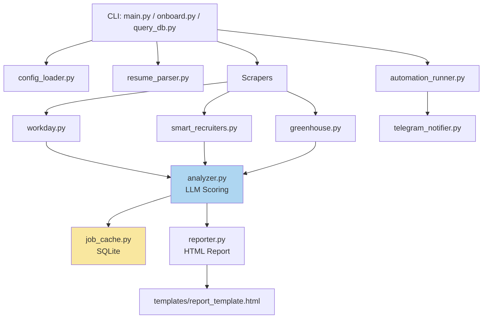

# Architecture Review — jobHunter_AG_o4.6

> Historical review snapshot from 2026-03-24. Several items in this document have since been implemented or partially addressed. Use `README.md` for the current runtime behavior and user guide.

**Reviewer**: Senior Architect · **Date**: 2026-03-24  
**Scope**: Full codebase (18 source files, config, CI, project structure)

---

## Executive Summary

The codebase is **functional and well-organized** for an early-stage pipeline tool. The scraper-analyzer-reporter flow is clean, the caching strategy is sound, and the config-driven multi-ATS design is a solid foundation. However, several structural, security, and reliability issues should be addressed before scaling further.

| Severity | Count |
|---|---|
| 🔴 Critical | 3 |
| 🟠 High | 5 |
| 🟡 Medium | 7 |
| 🔵 Low / Hygiene | 4 |

---

## 🔴 Critical Issues

### 1. Zero Test Coverage

There are **no unit tests, integration tests, or test infrastructure** anywhere in the repo. For a pipeline that makes LLM API calls ($) and scrapes live sites, this is high risk.

**Impact**: Any refactor, scoring version bump, or ATS API change can silently break the pipeline.

**Recommendation**:
- Add `pytest` + `pytest-cov` to [requirements.txt](file:///d:/Agents/jobHunter_AG_o4.6/requirements.txt)
- Priority test targets: [_parse_llm_response()](file:///d:/Agents/jobHunter_AG_o4.6/src/analyzer.py#452-515), [_compute_final_score()](file:///d:/Agents/jobHunter_AG_o4.6/src/analyzer.py#376-412), [_apply_location_preferences()](file:///d:/Agents/jobHunter_AG_o4.6/src/analyzer.py#334-374), `JobCache.make_job_key()`, `JobCache.lookup()`, scraper [_process_posting()](file:///d:/Agents/jobHunter_AG_o4.6/src/scrapers/workday.py#417-485) methods
- Mock the OpenRouter API for analyzer tests; mock `requests.Session` for scraper tests

---

### 2. API Key Leaked into SQLite Cache

[analyzer.py:211-216](file:///d:/Agents/jobHunter_AG_o4.6/src/analyzer.py#L211-L216) stores `raw_system_prompt` and `raw_user_prompt` (which includes the **full resume text**) into the SQLite database via [job_cache.py:287-290](file:///d:/Agents/jobHunter_AG_o4.6/src/job_cache.py#L287-L290). While the API key itself isn't stored, the **full resume** (PII) is persisted in every row's `raw_user_prompt`.

**Impact**: The [job_history.db](file:///d:/Agents/jobHunter_AG_o4.6/data/job_history.db) file (6.5 MB and growing) is a PII store. If this DB is ever shared (Git, backup, artifact), candidate data leaks.

**Recommendation**:
- Do NOT store `raw_user_prompt` in its entirety — strip the resume text before persisting
- Or add a separate [debug](file:///d:/Agents/jobHunter_AG_o4.6/src/job_cache.py#300-337) flag that controls whether debug payloads are stored
- Ensure [data/job_history.db](file:///d:/Agents/jobHunter_AG_o4.6/data/job_history.db) is in [.gitignore](file:///d:/Agents/jobHunter_AG_o4.6/.gitignore) (✅ it is), but also consider encrypting at rest

---

### 3. `BaseScraper.fetch_jobs()` Return Type Mismatch

[base.py:22-27](file:///d:/Agents/jobHunter_AG_o4.6/src/scrapers/base.py#L22-L27) declares [fetch_jobs()](file:///d:/Agents/jobHunter_AG_o4.6/src/scrapers/workday.py#326-416) as returning `list[dict]`, but all three concrete scrapers return `tuple[list[dict], dict]` (jobs + filter_stats). The abstract contract is wrong.

**Impact**: Any code relying on the typed interface will break. Static type checkers flag this.

**Fix**: Update [base.py](file:///d:/Agents/jobHunter_AG_o4.6/src/scrapers/base.py):
```diff
- def fetch_jobs(...) -> list[dict]:
+ def fetch_jobs(...) -> tuple[list[dict], dict]:
```

---

## 🟠 High Priority Issues

### 4. Duplicated `SCRAPERS` Registry

The `SCRAPERS` dict is defined **identically** in both [main.py:19-23](file:///d:/Agents/jobHunter_AG_o4.6/main.py#L19-L23) and [onboard.py:29-33](file:///d:/Agents/jobHunter_AG_o4.6/onboard.py#L29-L33). Adding a new ATS requires editing two files.

**Recommendation**: Move to a single registry in [src/scrapers/__init__.py](file:///d:/Agents/jobHunter_AG_o4.6/src/scrapers/__init__.py) and import from there.

---

### 5. SmartRecruiters Scraper Uses Slug Instead of Company Name

[smart_recruiters.py:196](file:///d:/Agents/jobHunter_AG_o4.6/src/scrapers/smart_recruiters.py#L196) sets `"company": slug` (the API identifier, e.g., `"Visa"`) instead of the human-readable [company_name](file:///d:/Agents/jobHunter_AG_o4.6/main.py#97-101) from config. Compare with [workday.py:483](file:///d:/Agents/jobHunter_AG_o4.6/src/workday.py#L483) and [greenhouse.py:297-300](file:///d:/Agents/jobHunter_AG_o4.6/src/scrapers/greenhouse.py#L297-L300), which correctly propagate [company_name](file:///d:/Agents/jobHunter_AG_o4.6/main.py#97-101).

**Impact**: Reports and cache keys may use mismatched company identifiers. A company named `"Visa Inc"` would appear as `"Visa"` in the SmartRecruiters pipeline but `"Visa Inc"` if ever processed by another scraper.

**Fix**: In [smart_recruiters.py](file:///d:/Agents/jobHunter_AG_o4.6/src/scrapers/smart_recruiters.py) [_process_posting()](file:///d:/Agents/jobHunter_AG_o4.6/src/scrapers/workday.py#417-485), pass `company_config` and use `company_config.get("company_name", slug)`.

---

### 6. No Rate Limiting / Retry Logic in Scrapers

The scrapers have basic `time.sleep()` politeness delays, but:
- No exponential backoff on HTTP errors
- No retry on transient 429/503 from ATS APIs
- The [analyzer.py](file:///d:/Agents/jobHunter_AG_o4.6/src/analyzer.py) has retry logic, but scrapers don't

**Impact**: A transient ATS blip silently drops the entire company from results.

**Recommendation**: Add a shared retry decorator or utility (e.g., `tenacity` or a simple loop) for HTTP requests in scrapers.

---

### 7. [onboard.py](file:///d:/Agents/jobHunter_AG_o4.6/onboard.py) Duplicates Config Read/Write Logic

[onboard.py](file:///d:/Agents/jobHunter_AG_o4.6/onboard.py) has its own [load_config()](file:///d:/Agents/jobHunter_AG_o4.6/src/config_loader.py#31-61) / [save_config()](file:///d:/Agents/jobHunter_AG_o4.6/onboard.py#49-54) that differ from [config_loader.py](file:///d:/Agents/jobHunter_AG_o4.6/src/config_loader.py)'s [load_config()](file:///d:/Agents/jobHunter_AG_o4.6/src/config_loader.py#31-61). The onboard version doesn't validate required fields and uses a different default model string (`"openrouter/hunter-alpha"`).

**Impact**: Config drift between the two loaders; onboard could produce a config that [main.py](file:///d:/Agents/jobHunter_AG_o4.6/main.py) then rejects.

**Recommendation**: Unify into [config_loader.py](file:///d:/Agents/jobHunter_AG_o4.6/src/config_loader.py) with separate [load](file:///d:/Agents/jobHunter_AG_o4.6/src/scrapers/workday.py#62-68) (validated) and `load_raw` (for editing) functions.

---

### 8. `import time` Inside a Loop Body

[analyzer.py:232](file:///d:/Agents/jobHunter_AG_o4.6/src/analyzer.py#L232) does `import time` inside the retry loop's except block instead of at module top.

**Impact**: Not a bug (Python caches imports), but it's a code smell that every linter flags and it signals the retry path was bolted on.

**Fix**: Move `import time` to the top of [analyzer.py](file:///d:/Agents/jobHunter_AG_o4.6/src/analyzer.py).

---

## 🟡 Medium Priority Issues

### 9. [config.json](file:///d:/Agents/jobHunter_AG_o4.6/config.json) Model Field vs. Environment Variable Ambiguity

[config.json](file:///d:/Agents/jobHunter_AG_o4.6/config.json) doesn't contain a `model` key, but [config_loader.py:46-53](file:///d:/Agents/jobHunter_AG_o4.6/src/config_loader.py#L46-L53) falls back to it if `OPENROUTER_MODEL` env isn't set. The README says env is preferred, but the config schema is ambiguous. This creates confusion for new users.

**Recommendation**: Either always require `OPENROUTER_MODEL` in [.env](file:///d:/Agents/jobHunter_AG_o4.6/.env) and remove the config fallback, or always require `model` in [config.json](file:///d:/Agents/jobHunter_AG_o4.6/config.json). Document one canonical path.

---

### 10. Hardcoded Paths Everywhere

Path construction is scattered: `DB_PATH`, `CONFIG_PATH`, `TEMPLATES_DIR`, `OUTPUT_DIR`, `CACHE_FILE` are all computed with `Path(__file__).resolve().parent.parent / ...`. This works for the current flat deployment but breaks if the project is installed as a package.

**Recommendation**: Centralize all path resolution into [config_loader.py](file:///d:/Agents/jobHunter_AG_o4.6/src/config_loader.py) (or a new `paths.py`) so there's a single source of truth for project root.

---

### 11. [query_db.py](file:///d:/Agents/jobHunter_AG_o4.6/query_db.py) Depends on `tabulate` — Not in [requirements.txt](file:///d:/Agents/jobHunter_AG_o4.6/requirements.txt)

[query_db.py:7](file:///d:/Agents/jobHunter_AG_o4.6/query_db.py#L7) imports `tabulate`, which is **not listed** in [requirements.txt](file:///d:/Agents/jobHunter_AG_o4.6/requirements.txt).

**Fix**: Add `tabulate>=0.9` to [requirements.txt](file:///d:/Agents/jobHunter_AG_o4.6/requirements.txt).

---

### 12. No Schema Validation for [config.json](file:///d:/Agents/jobHunter_AG_o4.6/config.json)

The config is loaded as raw JSON with only a check for the [companies](file:///d:/Agents/jobHunter_AG_o4.6/onboard.py#66-91) key. Invalid values (wrong types, typos in field names like `receny_days`, missing nested fields) are silently accepted.

**Recommendation**: Use `pydantic` (or even a simple dataclass + manual checks) to validate the config shape at load time. This would catch typos and missing fields immediately instead of at runtime.

---

### 13. Inconsistent Error Handling in [main.py](file:///d:/Agents/jobHunter_AG_o4.6/main.py) Company Loop

[main.py:151-163](file:///d:/Agents/jobHunter_AG_o4.6/main.py#L151-L163): When a company is a plain string (not onboarded), the code instantiates [WorkdayScraper()](file:///d:/Agents/jobHunter_AG_o4.6/src/scrapers/workday.py#50-533) and calls [discover()](file:///d:/Agents/jobHunter_AG_o4.6/src/scrapers/workday.py#79-124), which can raise `RuntimeError`. But the outer `try/except` at line 194 catches generic `Exception`, so a failed discovery still produces a confusing error log rather than a clean skip.

**Recommendation**: Catch the `RuntimeError` from [discover()](file:///d:/Agents/jobHunter_AG_o4.6/src/scrapers/workday.py#79-124) explicitly and log a clear skip message.

---

### 14. [prepare_results()](file:///d:/Agents/jobHunter_AG_o4.6/src/reporter.py#179-204) Called Twice

[main.py:290](file:///d:/Agents/jobHunter_AG_o4.6/main.py#L290) calls [prepare_results(all_jobs)](file:///d:/Agents/jobHunter_AG_o4.6/src/reporter.py#179-204), and then [reporter.py:282](file:///d:/Agents/jobHunter_AG_o4.6/src/reporter.py#L282) calls [prepare_results(results)](file:///d:/Agents/jobHunter_AG_o4.6/src/reporter.py#179-204) again inside [generate_report()](file:///d:/Agents/jobHunter_AG_o4.6/src/reporter.py#262-344). The function mutates jobs in-place (sorts, adds display fields), so the double-call is benign but wasteful and confusing.

**Fix**: Remove the call inside [generate_report()](file:///d:/Agents/jobHunter_AG_o4.6/src/reporter.py#262-344) since [main.py](file:///d:/Agents/jobHunter_AG_o4.6/main.py) already calls it.

---

### 15. [.gitignore](file:///d:/Agents/jobHunter_AG_o4.6/.gitignore) Is Overly Specific for `__pycache__`

```
__pycache__/
src/__pycache__/
src/scrapers/__pycache__/
scripts/__pycache__/
```

The first line (`__pycache__/`) alone would catch all of these with a glob. The extra entries are redundant.

---

## 🔵 Low Priority / Hygiene

### 16. Mixed Line Endings (CRLF + LF)

[config.json](file:///d:/Agents/jobHunter_AG_o4.6/config.json), [automation_runner.py](file:///d:/Agents/jobHunter_AG_o4.6/scripts/automation_runner.py), and parts of [README.md](file:///d:/Agents/jobHunter_AG_o4.6/README.md) have `\r\n` (CRLF) while the rest uses `\n` (LF). This causes noisy diffs.

**Fix**: Add a `.editorconfig` or `.gitattributes` to enforce consistent line endings.

---

### 17. [filter_test.log](file:///d:/Agents/jobHunter_AG_o4.6/filter_test.log) Committed to Root

A 9 KB test log file ([filter_test.log](file:///d:/Agents/jobHunter_AG_o4.6/filter_test.log)) is sitting in the project root — likely from a debugging session. 

**Fix**: Delete and add `*.log` to [.gitignore](file:///d:/Agents/jobHunter_AG_o4.6/.gitignore).

---

### 18. No Type Stubs / `py.typed` Marker

The project uses Python 3.12+ type syntax (`str | None`, `list[str]`) consistently — which is good — but there's no `mypy` or `pyright` config, so these annotations are never checked.

**Recommendation**: Add `mypy` to dev dependencies and a basic `mypy.ini` or `pyproject.toml [tool.mypy]` section.

---

### 19. [resume.pdf](file:///d:/Agents/jobHunter_AG_o4.6/resume.pdf) in the Repo Root

The actual resume PDF (840 KB) is in the repo root but **not in [.gitignore](file:///d:/Agents/jobHunter_AG_o4.6/.gitignore)**. If this is a real resume, it's PII being version-controlled.

> [!CAUTION]
> This is a privacy risk. Add [resume.pdf](file:///d:/Agents/jobHunter_AG_o4.6/resume.pdf) to [.gitignore](file:///d:/Agents/jobHunter_AG_o4.6/.gitignore) immediately and remove it from Git history if it has been committed.

---

## Architecture Diagram



---

## Prioritized Action Plan

| Priority | Item | Effort |
|---|---|---|
| 🔴 P0 | Add [resume.pdf](file:///d:/Agents/jobHunter_AG_o4.6/resume.pdf) and `*.log` to [.gitignore](file:///d:/Agents/jobHunter_AG_o4.6/.gitignore) | 5 min |
| 🔴 P0 | Fix `BaseScraper.fetch_jobs()` return type | 5 min |
| 🔴 P0 | Stop storing full resume text in SQLite | 1 hr |
| 🟠 P1 | Add missing `tabulate` to [requirements.txt](file:///d:/Agents/jobHunter_AG_o4.6/requirements.txt) | 5 min |
| 🟠 P1 | Fix SmartRecruiters company name field | 15 min |
| 🟠 P1 | Unify scrapers registry in one place | 30 min |
| 🟠 P1 | Move `import time` to top of [analyzer.py](file:///d:/Agents/jobHunter_AG_o4.6/src/analyzer.py) | 5 min |
| 🟠 P1 | Remove duplicate [prepare_results()](file:///d:/Agents/jobHunter_AG_o4.6/src/reporter.py#179-204) call | 5 min |
| 🟡 P2 | Add basic pytest infrastructure + core tests | 4 hr |
| 🟡 P2 | Unify config loaders (onboard vs. main) | 1 hr |
| 🟡 P2 | Add config schema validation (pydantic) | 2 hr |
| 🟡 P2 | Add retry/backoff to scraper HTTP calls | 2 hr |
| 🟡 P2 | Centralize path resolution | 1 hr |
| 🔵 P3 | Add `.editorconfig` for line endings | 10 min |
| 🔵 P3 | Add `mypy` to dev dependencies | 30 min |
| 🔵 P3 | Clean up [.gitignore](file:///d:/Agents/jobHunter_AG_o4.6/.gitignore) `__pycache__` entries | 5 min |
